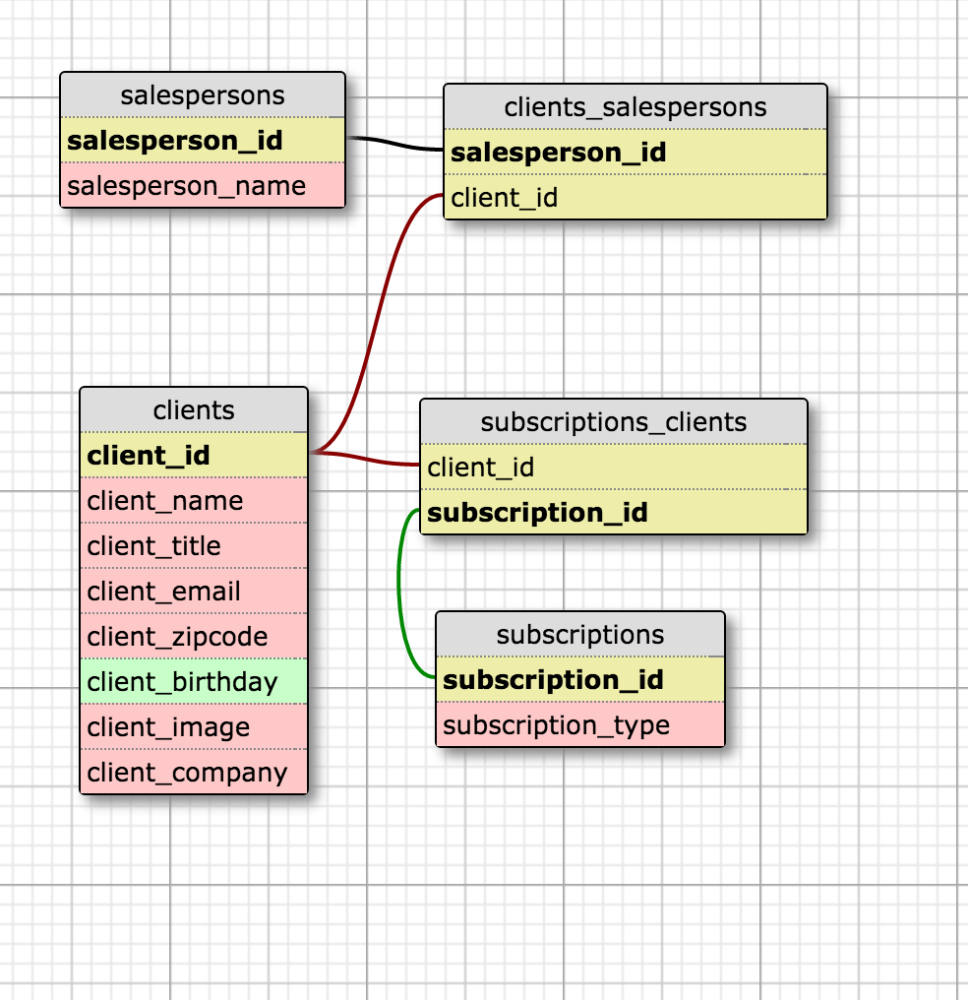

[](https://floobits.com/urbantumbleweed/client-recon/redirect)

# Rappo.rt
Sales and account management relationship augmentation engine


##Database Schema




##Existing API Endpoints

|      URL                           | HTTP Verb | Request Body |                         Result                          |
|:----------------------------------:                    |:---------:|:------------:|:-------------------------------------------------------:|
| /             |    GET    |    empty     | Serve application static files
| /api/users/:user_id/clients             |    GET    |    empty     | Return JSON array of all users for for a userId
| /api/users/:user_id/clients             |    POST    |    JSON     | Create a client for salesperson with :user_id sending JSON for the new user.
| /api/users/:user_id/clients/:client_id  |    PUT    |     JSON     |  Edit client with clientId in the context of a user with userId


##Data Formats
####Client object format.  The object that is on req.body for both `POST` and `PUT`.

```json
{
  "client_name": "string",
  "client_email": "string"
  "client_birthday": "string"
  "client_company": "string"
  "client_zipcode": "string"
  "client_title": "string"
  "client_image": "string"
}
```

##Outgoing API Endpoints

|API NAME | Base_URL | HTTP Verb | Request Body |   Used Fields                          |
|:-------:|:-----------------:|:---------:|:------------:|:-------------------------------------------------------:|
| Twilio  | https://api.twilio.com/2010-04-01/Accounts |    GET    |    None     | Sends a text message, response is JSON object
| Bing News  | npm modules: node-bing-api             |    GET    |    JSON     |  Array of articles: Description, Title, Article Url
| Open Weather  | http://api.openweathermap.org/data/2.5/weather  |    GET    |    JSON     | Temp, Location, Description, IconId
| Seat Geek  | http://api.seatgeek.com/2/performers  |    GET    |     JSON     |  Edit client with clientId in the context of a user with userId


##File structure

```ascii
.
├── LICENSE
├── README.md
├── api
│   ├── index.js
│   └── twilio-api.js
├── client
│   ├── app
│   │   ├── app.js
│   │   ├── client-profile
│   │   │   ├── bio
│   │   │   │   ├── bio.html
│   │   │   │   └── bioController.js
│   │   │   ├── client-profile.html
│   │   │   ├── clientProfileController.js
│   │   │   ├── feed
│   │   │   │   ├── feed.html
│   │   │   │   └── feedController.js
│   │   │   └── index.js
│   │   ├── dashboard
│   │   │   ├── dashboard.html
│   │   │   ├── dashboardController.js
│   │   │   └── index.js
│   │   ├── edit-client
│   │   │   ├── edit-client.html
│   │   │   └── editClientController.js
│   │   ├── new-client
│   │   │   ├── new-client.html
│   │   │   └── newClientController.js
│   │   └── services
│   │       ├── appState.js
│   │       ├── clientApi.js
│   │       └── index.js
│   ├── assets
│   │   ├── loading.gif
│   │   ├── recon-eagle-400.png
│   │   └── recon-eagle.png
│   ├── bower.json
│   ├── index.html
│   └── styles
│       └── style.css
├── client-recon.graffle
├── config
│   └── index.js
├── contribute.html
├── contribute.md
├── db
│   ├── config.js
│   ├── index.js
│   ├── psql
│   │   ├── create-subscription.sql
│   │   ├── edit-one-client.sql
│   │   ├── get-all-clients.sql
│   │   ├── getAllClients.js
│   │   ├── index.js
│   │   ├── insertClientSales.sql
│   │   └── insertUser.sql
│   ├── sample.sql
│   └── schema.js
├── github.md
├── keys.sh
├── package.json
├── server
│   ├── controllers
│   │   ├── client-controller.js
│   │   ├── dashboard-controller.js
│   │   ├── feed-controller.js
│   │   ├── index.js
│   │   └── user-controller.js
│   ├── helpers
│   │   ├── bing-search-api.js
│   │   ├── index.js
│   │   └── weather-api.js
│   ├── models
│   │   ├── client-model.js
│   │   ├── index.js
│   │   ├── subscription-model.js
│   │   └── user-model.js
│   ├── routes
│   │   └── index.js
│   └── server.js
└── test
    ├── client
    │   └── app
    │       ├── client-profile
    │       │   └── index.js
    │       ├── dashboard
    │       │   └── index.js
    │       ├── new-client
    │       │   └── index.js
    │       └── services
    │           └── index.js
    ├── db
    │   └── indexSpec.js
    └── server
        ├── controllers
        │   └── index.js
        ├── helpers
        │   └── index.js
        ├── models
        │   └── index.js
        └── routes
            └── index.js

```
